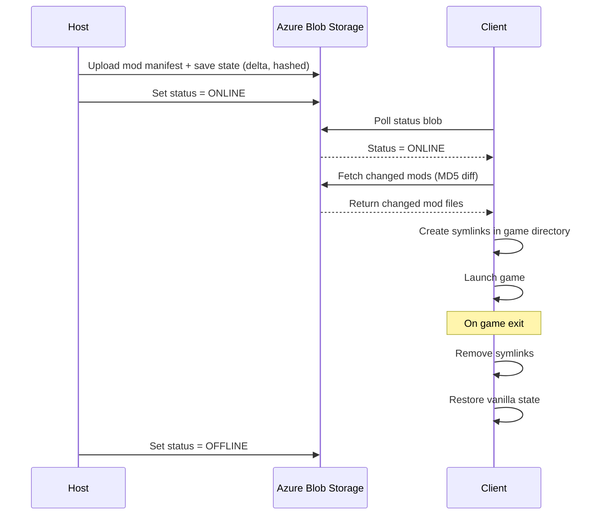

# Distributed Game State & Mod Sync Pipeline

A cloud-backed, one-click synchronization pipeline built to solve mod-matching and save-state drift in peer-to-peer multiplayer games. Originally developed to manage Green Hell co-op sessions, this tool allows a friend group to instantly sync complex mod loadouts and host-authoritative saves without permanently modifying their local game installs.

## Problem

Peer-to-peer multiplayer games frequently bind world state and mod
dependencies to local machine paths, with no built-in mechanism for a host
to guarantee that every connected client is running an identical mod set
or has an up-to-date save. In practice this means manual file distribution,
version drift between players, and no way to verify session readiness
before launch.

This project replaces that manual process with a cloud-mediated pipeline:
a host publishes mod state and save data to Azure Blob Storage; clients
pull only what has changed via content-hash comparison; a status flag
broadcasts host availability so clients never attempt to join a session
that isn't ready.

## Architecture



**Host side**
- `daemon_sync.py` — filesystem watcher (`watchdog`) triggering debounced,
  gzip-compressed, MD5-deduplicated save uploads on write events.
- `admin_dashboard.py` — environment/profile management GUI; writes a
  single canonical config consumed by every other component.
- `deployment_mod_manager.py` — concurrent (`ThreadPoolExecutor`) delta-hash mod
  deployment; only uploads changed assets, generates a `load_order.txt`
  manifest per environment.

**Client side**
- `client_launcher.py` — pre-flight validation (disk space, process
  conflicts, host-availability handshake against a status blob), then
  triggers sync.
- `cloud_fetcher.py` — pulls only outdated/missing assets by MD5
  comparison against the manifest; provisions the mod loader
  (version-pinned, idempotent) if not already present.
- Symlink-based runtime injection maps synced mod files from an isolated
  local cache into the live game directory without permanently modifying
  it, and a background watchdog thread reverts every change on process
  exit — the game directory returns to a byte-identical vanilla state
  regardless of what was injected during the session.

## Design decisions

- **Content-hash delta sync over full re-transfer.** Mod packs and saves
  are re-synced by MD5 comparison rather than blind re-download, since
  naive full-sync doesn't scale with repeated sessions or larger mod
  packs.
- **Symlink injection over direct file copy.** Mods are never copied
  directly into the game directory; they're synced to an isolated cache
  and symlinked in only for the session's duration, so a corrupted sync
  or an incompatible mod can never leave the base install in a broken
  state.
- **Status blob as a distributed lock signal.** Clients never attempt a
  session join without first confirming a live host signal, avoiding a
  class of "silent failure" where a client syncs and launches against a
  session that isn't actually being hosted.
- **Single canonical config.** Early iterations split configuration
  across two independently-writable files consumed by different
  components; this created state-drift bugs where one component's view
  of "active environment" silently diverged from another's. Consolidated
  to one config, written and read by every component identically.

## Known limitations

- Client-triggered state changes (e.g. structure placement, item pickup)
  are constrained by the target game's host-authoritative multiplayer
  model. Mods that don't implement an explicit host-sync RPC will only
  correctly apply changes when triggered by the host; this is a
  constraint of the underlying game's mod API, not of this pipeline.
- The current design assumes one active hosted environment at a time
  (sequential, not concurrent, session support). Multi-session concurrency
  would require per-environment daemon isolation rather than the current
  single-process model.

## Tech stack

- **Language:** Python 3.x
- **Cloud:** Azure Blob Storage (`azure-storage-blob`)
- **GUI:** CustomTkinter
- **Concurrency/OS:** `threading`, `concurrent.futures`, `subprocess`,
  `watchdog`, `psutil`

## Setup

```bash
git clone <repo>
cd <repo>
pip install -r requirements.txt
cp .env.example .env
# fill in your own Azure connection details in .env
```

## License

MIT
